

<a href="https://www.nexusmods.com/profile/Big2What"></a>

<a href="https://github.com/Big2What-Mods/Cyberpunk-2077-Iconic-ID-Tag-Dumper"></a><a href="https://github.com/Big2What-Mods/CP2077-Achievement-Logic"></a>
<a href="https://github.com/Big2What-Mods/CP2077-Journal-State-Tracer"></a><a href="https://github.com/Big2What-Mods/Cynosure_Terminal_Teaser---H10_Bathroom_Poster"></a>
<a href="https://github.com/Big2What-Mods/Misty-s_Esoterica_Poster-H10_Bathroom"></a><a href="https://github.com/Big2What-Mods/Viktor_Vektor_Ripperdoc_Poster-H10_Bathroom"></a>
<a href="https://github.com/Big2What-Mods/El_Coyote_Cojo-_Bar_Poster-H10_Bathroom"></a>

