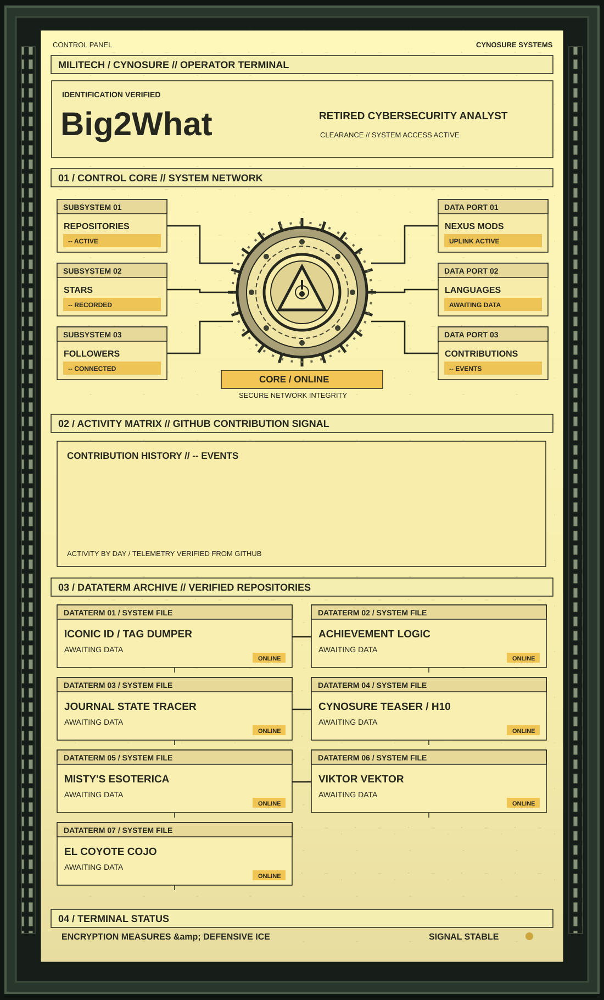

<a href="https://www.nexusmods.com/profile/Big2What"><b>ACCESS NEXUS MODS PROFILE</b></a>

<b>Repository module links</b>

- [Module 01: Iconic ID / Tag Dumper](https://github.com/Big2What-Mods/Cyberpunk-2077-Iconic-ID-Tag-Dumper)
- [Module 02: Achievement Logic](https://github.com/Big2What-Mods/CP2077-Achievement-Logic)
- [Module 03: Journal State Tracer](https://github.com/Big2What-Mods/CP2077-Journal-State-Tracer)
- [Module 04: Cynosure Teaser / H10](https://github.com/Big2What-Mods/Cynosure_Terminal_Teaser---H10_Bathroom_Poster)
- [Module 05: Misty's Esoterica](https://github.com/Big2What-Mods/Misty-s_Esoterica_Poster-H10_Bathroom)
- [Module 06: Viktor Vektor](https://github.com/Big2What-Mods/Viktor_Vektor_Ripperdoc_Poster-H10_Bathroom)
- [Module 07: El Coyote Cojo](https://github.com/Big2What-Mods/El_Coyote_Cojo-_Bar_Poster-H10_Bathroom)

